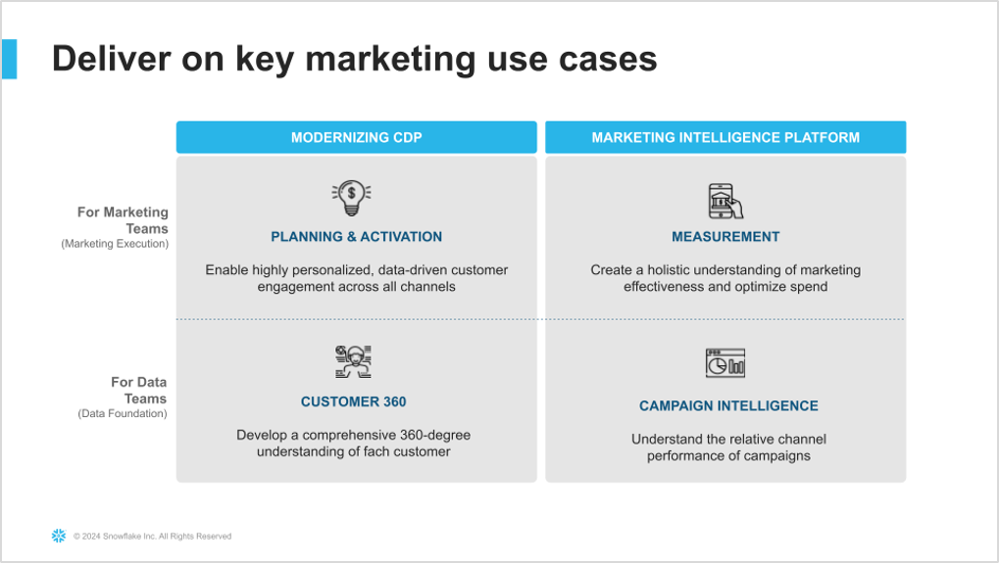
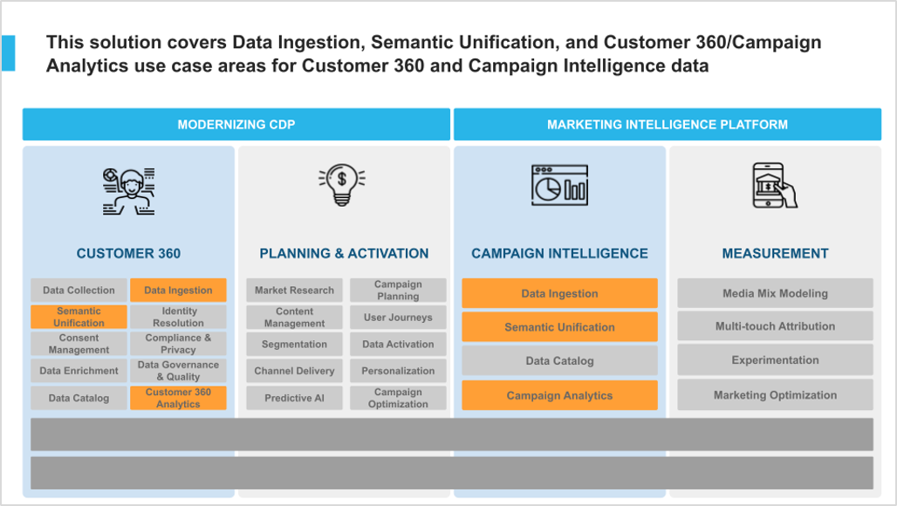

{{ build_badge() }}

# Welcome to the Marketing Data Foundation Native App

## Before you start
> [!IMPORTANT]  
> Please make sure that your account has the following features enabled. Go to your account deployment and enable the features mentioned below:

### Disable CANCEL_CHILD_JOBS_UPON_PARENT_COMPLETION


### Custom Components
``` SQL
alter account {{account_locator}} set CANCEL_CHILD_JOBS_UPON_PARENT_COMPLETION = false parameter_comment='allow async execution of SP for native apps';
alter account {{account_locator}} set ENABLE_STREAMLIT_ALLOW_COMPONENTS_V1_IFRAME = true parameter_comment='internal account / demo app, enabling custom component for native apps';
alter account {{account_locator}} set ENABLE_STREAMLIT_ARBITRARY_INLINE_JS = true parameter_comment='internal account / demo app, enabling custom component for native apps';
alter account {{account_locator}} set ENABLE_STREAMLIT_ARBITRARY_INLINE_CSS = true parameter_comment='internal account / demo app, enabling custom component for native apps';
alter account {{account_locator}} set ENABLE_STREAMLIT_ALLOW_MARKDOWN_WITH_HTML = true parameter_comment='internal account / demo app, enabling custom component for native apps';
```

### Snowflake Notebooks

``` SQL
alter account {{account_locator}} set
ENABLE_STREAMLIT = true,
FEATURE_NOTEBOOKS_V1 = 'ENABLED'  parameter_comment = 'notebook wh prpr';

alter account {{account_locator}} set UI_ENABLE_NOTEBOOK_CELL_STATUS = 'enabled' parameter_comment = 'notebook wh prpr';


// For the scheduler feature:
alter account {{account_locator}} set FEATURE_UI_ENABLE_NOTEBOOKS_SCHEDULING = 'ENABLED' parameter_comment = 'notebook wh scheduling prpr';
alter account {{account_locator}} set FEATURE_NOTEBOOKS_NON_INTERACTIVE_EXECUTION = 'ENABLED' parameter_comment = 'notebook wh scheduling prpr';

// For the stage importing feature:
alter account {{account_locator}} set ENABLE_FIX_910999_SKIP_CLEANUP_IN_FIRST_CODE_STAGE_DOWNLOAD = true
ENABLE_NOTEBOOK_PACKAGES_FROM_STAGE = true
FEATURE_UI_ENABLE_NOTEBOOK_PACKAGES_FROM_STAGE = 'ENABLED'
parameter_comment = 'Enable module importer for Notebooks';
```

### Cortex Analyst

This application leverages [Cortex Analyst](https://docs.snowflake.com/LIMITEDACCESS/snowflake-cortex/cortex-copilot-api-overview) currently on PrPr.

Request this feature to be enabled in your account using the slack channel:
[#sp-copilot-api-onboarding](https://snowflake.enterprise.slack.com/archives/C06T6T50G01)

### Enable Custom Components in Application Package

This should be enabled after the application is deployed in your account, otherwise you will see a **not supported component** error.

``` SQL
alter database {{account_locator}}.MARKETING_DATA_FOUNDATION_PKG set ENABLE_NATIVE_APPLICATION_PACKAGE_FOR_STREAMLIT_CUSTOM_COMPONENTS = true parameter_comment='internal account / demo app, enabling custom component for native apps';

```

## <ins>Introduction:</ins>

Customers looking to use Snowflake for marketing use cases initially face a significant challenge: it is difficult to import all relevant marketing data into Snowflake and structure it in a unified format that downstream applications can easily utilize to power data-driven marketing.
This starter solution tackles this challenge by offering an integrated application that unifies data sets from different Connectors and Marketing Data providers.

In this example we are adding support for 
  - Fivetran / Facebook Ads
  - Omnata / LinkedIn Ads

This solution was inspired by how Snowflake runs its own end-to-end Marketing workflows entirely on top of the Snowflake Marketing Data Cloud.

As context, here is the related collateral for the overall Marketing Data Cloud: 

Sales Play:
[https://snowflake.seismic.com/Link/Content/DCGV3bHFV6BX28f2hfCgjDfjVWBj](https://snowflake.seismic.com/Link/Content/DCGV3bHFV6BX28f2hfCgjDfjVWBj)

Deck
[https://snowflake.seismic.com/Link/Content/DCM298mQFHm8bGmPT92RRfb7VFFd](https://snowflake.seismic.com/Link/Content/DCM298mQFHm8bGmPT92RRfb7VFFd)

## <ins>Problem Space:</ins>

In the fast-evolving marketing landscape, the emphasis on data-driven strategies has become more pronounced than ever. A significant trend is the increase in Martech investments, with 63% of Chief Marketing Officers (CMOs) planning to increase their spending within the next 12 months. Such investments are crucial for enhancing customer engagement, refining marketing strategies, and driving sales through advanced data analysis.
The high ROI that businesses achieve from data-driven personalization also highlights its importance. Reports indicate that enterprises see returns of 5 to 8 times on their marketing budgets, which demonstrates the value of personalized marketing in boosting conversion rates, enhancing customer loyalty, and increasing revenue.

Additionally, the industry is shifting towards first-party data ownership, a move propelled by the deprecation of third-party cookies. This shift is essential for maintaining direct customer relationships and adapting to changing privacy norms. The promise of generative AI and the understanding that an effective AI strategy requires a robust data strategy have spurred efforts to centralize marketing data within Snowflake. Organizations aim to organize data into standard schemas that Large Language Models (LLMs) can understand, employing these models in innovative ways to personalize content and predict customer behavior.
Two types of first-party data are pivotal in these efforts: Customer 360 Data and Campaign Intelligence. The former strives to provide a holistic view of the customer by integrating and managing comprehensive data. In contrast, Campaign Intelligence focuses on data related to marketing campaigns, aiming to optimize performance and strategy. These elements are fundamental to successful data-driven marketing, underscoring the need for sophisticated data management and analytics capabilities.


## <ins>Solution Space:</ins>

### Context

As described in the diagram below, the two Data Foundation use cases in this starter lay the groundwork to support the two Marketing Execution use cases: Planning & Activation,  and Measurement. 



More specifically, this solution covers Data Ingestion, Semantic Unification, and based Analytics use cases for Customer 360 and Campaign Intelligence data. 



## <ins>Solution Details:</ins>

### Solution Components

The solution consists of the following components:

  - <b>Jupyter Notebooks:</b> This is the primary interface used to build this demo.
  - <b>Native Application:</b> The code needed to build and deploy this solution as a Native App. You will deploy this app in your own Snowflake account. 
  - <b>Solution Steps:</b> Step-by-step instructions for installing the Native app in your own Snowflake account are available in the Setup notebook. 
  - <b>Solution Recording:</b> This shows a recording of the demo. It starts by introducing the Jupyter Notebook and then covers the Native Application.


## <ins>Access to the Marketing Data Foundation Starter app:</ins>

**The app is already deployed to your Snowflake instance, please click the button below launch the native app:**

[Marketing Data Foundation App]({{ env_var("MARKETING_DATA_FOUNDATION_URL") }}){ .md-button target='_blank' }


**To view Snowsight click the button below:**

{{ snowsight_button() }}

**To view the notebook code that was executed to deploy the apps, please click the below link to see the code repository:**

{{ dde_button("solution/homepage/docs") }}


## Architecture:

This demo consists of a native application that provides a framework to easily unify marketing data sources and then leverage LLM functions to explore that data and get valuable business intelligence information from the data that was ingested.


## <ins>Additional Solution Details:</ins>

### Snowflake Featured Leveraged
  - Snowpark for Python
  - Streamlit
  - NativeApp
  - Cortex API
  - Snowflake Notebooks


### Solution Information 

- **Title:** Snowflake for Marketing
- [Demo Recording - TBD](https://RECORDING_LINK)
- **Point of Contacts:** [Onil Gunawardana](onil.gunawardana@snowflake.com), [Jim Warner](jim.warner@snowflake.com), [Guan Wang](guan.wang@snowflake.com), [Lourenco Mello](lourenco.mello@snowflake.com), [Naveen Alan,Thomas](naveenalan.thomas@snowflake.com), [Carl-Johan Wehtje](carl-johan.wehtje@snowflake.com),
[Jorge Fallas](jorge.fallasramos@snowflake.com),
[Manuel Figueroa](manuel.figueroa@snowflake.com)